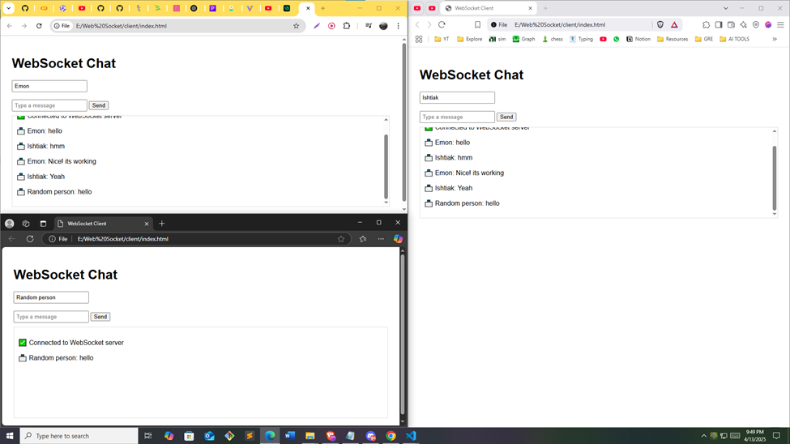

# 💬 Real-Time WebSocket Chat App

This is a simple **real-time chat application** built using **Node.js** and the native **WebSocket protocol**. It supports multiple clients chatting live through the browser!

> 🧠 This project marks my very first time learning and implementing **WebSockets** — to understand how real-time communication works at a basic level.  
> It's a baseline demo to experiment and build from here.

---

## 🔧 Features

- Connect multiple clients in different browsers
- Real-time messaging using WebSocket
- Simple UI for entering username and sending messages
- Live broadcast to all connected users

---

## 🚀 Technologies Used

- **Node.js**
- **Express.js**
- **WebSocket (ws)** library
- **Vanilla JavaScript** for the frontend

---

## 🖼️ Live Chat Screenshot

> 📸 Here's a screenshot of three clients chatting live:

